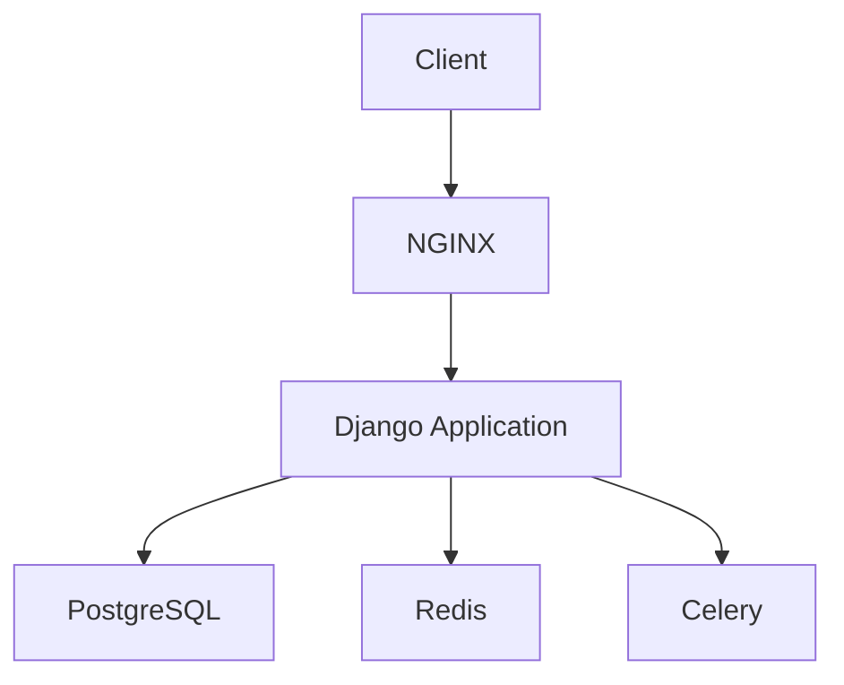

# System Architecture

## Overview

## Components
### Core Modules
- **Authentication**: JWT-based auth system
- **Permissions**: Role-based access control
- **Middleware**: IP filtering, logging

### Main Applications
1. **Accounts**: User management
2. **Inventory**: Drug stock management
3. **Orders**: Purchase and sales processing  
4. **Stock**: Warehouse management
5. **Permit**: Access control

## Data Flow
1. Request → NGINX → Django
2. Django processes request:
   - Authentication
   - Permission checks
   - Business logic
3. Response returned to client

## Dependencies
- PostgreSQL: Primary database
- Redis: Caching and Celery broker
- Celery: Async task processing
